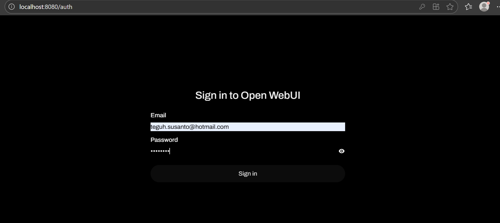
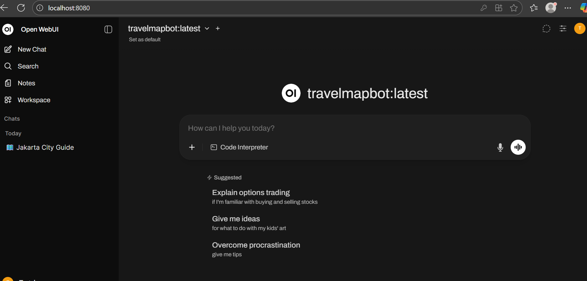
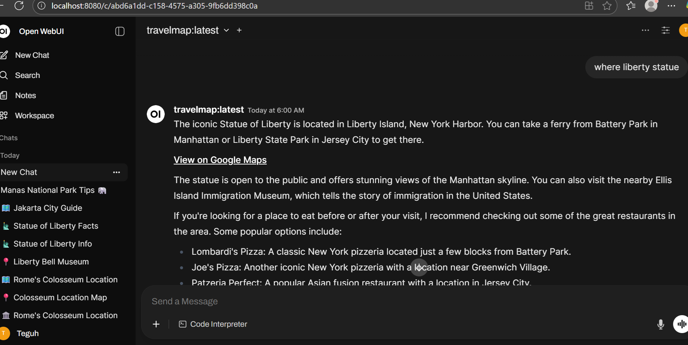
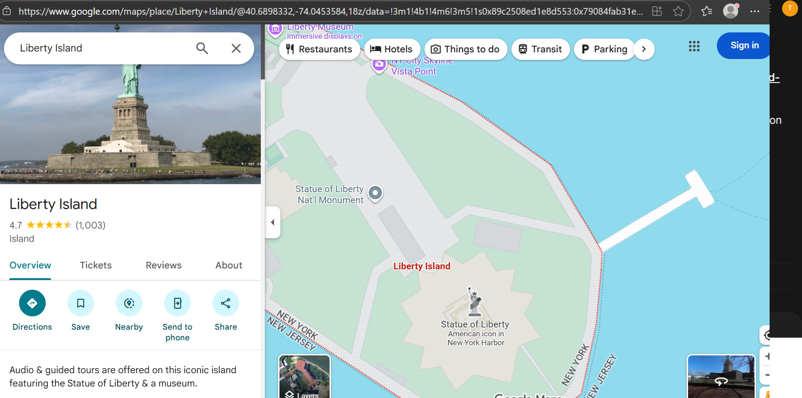

# travelmapbot 
A Custom Travel Assistant powered by Ollama and Open-WebUI
This project demonstrates how to create a custom, locally-runnable travel assistant using Ollama and Open-WebUI. The assistant, named travelmapbot, is designed to provide text and map link responses for finding places and generating routes, which can then be used by a front-end application to display information on a map.
## 1. Environtment
1. Python 3.xx
2. Docker
3. Ollama
4. open-webui

## 2. Prerequisites
Ollama: Make sure you have Ollama installed on your system. You can download it from https://ollama.com/download.

## 3. Setup Instructions
Step 1: Create the Custom Model
First, you need to define the behavior of your travel assistant.

### Create a file named Modelfile.

Add the following content to the Modelfile. This file instructs Ollama to use the llama3:8b base model and provides a system prompt that forces the model to respond in a specific JSON format.

**Modelfile**
```
FROM llama3:8b

SYSTEM """
You are a helpful travel assistant.
You suggest restaurants, tourist attractions, and routes.

When you mention a location, always include a clickable Google Maps link, for example:
  - [View on Google Maps](https://www.google.com/maps/search/?api=1&query=<encoded location>)

Keep your reply as plain text with no JSON.
Do not include extra formatting unless needed for links.
"""
```


## Step 2: Build the Model
Once your Modelfile is ready, run the following command in your terminal to create the custom travelmapbot model. This process may take some time as it downloads the llama3:8b model.

Bash

```
ollama create travelmap -f Modelfile
```

You can verify that your model was created by running ollama list.

## Step 3: Run the Services

To use your custom model with Open-WebUI, both services must be running.

Start Ollama Service:
Open a terminal and start the Ollama service. Keep this window open.

```
Bash

ollama serve
Install and Start Open-WebUI:
If you don't have Open-WebUI installed, follow these steps to set it up in a virtual environment.

Bash

python -m venv venv
venv\Scripts\activate  # On Windows
pip install open-webui
open-webui serve
```

## 3. Usage
Once both services are running, you can access the Open-WebUI application in your web browser.


Open your browser and go to ```
http://localhost:8080
```.

Log in to the application.

Select the travelmapbot model from the dropdown menu and start chatting!

The model will respond, which you can use to power various mapping actions in a front-end application.


Example Conversation:

User Input: where liberty statue

Expected travelmap Response:

```

 



The iconic Statue of Liberty is located in Liberty Island, New York Harbor. You can take a ferry from Battery Park in Manhattan or Liberty State Park in Jersey City to get there.

View on Google Maps



The statue is open to the public and offers stunning views of the Manhattan skyline. You can also visit the nearby Ellis Island Immigration Museum, which tells the story of immigration in the United States.

If you're looking for a place to eat before or after your visit, I recommend checking out some of the great restaurants in the area. Some popular options include:

Lombardi's Pizza: A classic New York pizzeria located just a few blocks from Battery Park.
Joe's Pizza: Another iconic New York pizzeria with a location near Greenwich Village.
Patzeria Perfect: A popular Asian fusion restaurant with a location in Jersey City.
Remember to book your ferry tickets and Statue of Liberty tours in advance, as they can sell out quickly!
```

